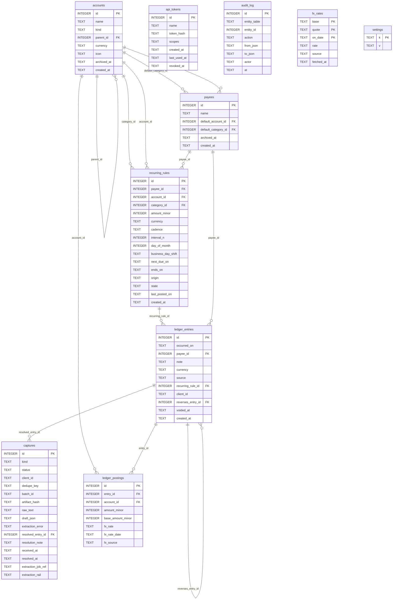

<!-- generated by `make erd` from the embedded migrations; do not edit -->
# Entity relationships

The schema as the database reports it. Regenerate with `make erd` after a migration.

```mermaid
erDiagram

    accounts {
        INTEGER id PK
        TEXT name
        TEXT kind
        INTEGER parent_id FK
        TEXT currency
        TEXT icon
        TEXT archived_at
        TEXT created_at
    }

    api_tokens {
        INTEGER id PK
        TEXT name
        TEXT token_hash
        TEXT scopes
        TEXT created_at
        TEXT last_used_at
        TEXT revoked_at
    }

    audit_log {
        INTEGER id PK
        TEXT entity_table
        INTEGER entity_id
        TEXT action
        TEXT from_json
        TEXT to_json
        TEXT actor
        TEXT at
    }

    captures {
        INTEGER id PK
        TEXT kind
        TEXT status
        TEXT client_id
        TEXT dedupe_key
        TEXT batch_id
        TEXT artifact_hash
        TEXT raw_text
        TEXT draft_json
        TEXT extraction_error
        INTEGER resolved_entry_id FK
        TEXT resolution_note
        TEXT received_at
        TEXT resolved_at
        TEXT extraction_job_ref
        TEXT extraction_rail
    }

    fx_rates {
        TEXT base PK
        TEXT quote PK
        TEXT on_date PK
        TEXT rate
        TEXT source
        TEXT fetched_at
    }

    ledger_entries {
        INTEGER id PK
        TEXT occurred_on
        INTEGER payee_id FK
        TEXT note
        TEXT currency
        TEXT source
        INTEGER recurring_rule_id FK
        TEXT client_id
        INTEGER reverses_entry_id FK
        TEXT voided_at
        TEXT created_at
    }

    ledger_postings {
        INTEGER id PK
        INTEGER entry_id FK
        INTEGER account_id FK
        INTEGER amount_minor
        INTEGER base_amount_minor
        TEXT fx_rate
        TEXT fx_rate_date
        TEXT fx_source
    }

    payees {
        INTEGER id PK
        TEXT name
        INTEGER default_account_id FK
        INTEGER default_category_id FK
        TEXT archived_at
        TEXT created_at
    }

    recurring_rules {
        INTEGER id PK
        INTEGER payee_id FK
        INTEGER account_id FK
        INTEGER category_id FK
        INTEGER amount_minor
        TEXT currency
        TEXT cadence
        INTEGER interval_n
        INTEGER day_of_month
        TEXT business_day_shift
        TEXT next_due_on
        TEXT ends_on
        TEXT origin
        TEXT state
        TEXT last_posted_on
        TEXT created_at
    }

    settings {
        TEXT k PK
        TEXT v
    }
    accounts ||--o{ accounts : "parent_id"
    ledger_entries ||--o{ captures : "resolved_entry_id"
    ledger_entries ||--o{ ledger_entries : "reverses_entry_id"
    recurring_rules ||--o{ ledger_entries : "recurring_rule_id"
    payees ||--o{ ledger_entries : "payee_id"
    accounts ||--o{ ledger_postings : "account_id"
    ledger_entries ||--o{ ledger_postings : "entry_id"
    accounts ||--o{ payees : "default_category_id"
    accounts ||--o{ payees : "default_account_id"
    accounts ||--o{ recurring_rules : "category_id"
    accounts ||--o{ recurring_rules : "account_id"
    payees ||--o{ recurring_rules : "payee_id"
```
