# Spenicle v2 — Data model & API

Companion to [`v2-design.md`](./v2-design.md). Operational docs: [`../README.md`](../README.md).

**10 tables, 21 endpoints, one sequence diagram each.**

Base path `/api`. No version prefix: we are the only consumer, and an agent can adapt to a
change faster than a `/v2` namespace can justify itself. Dates `YYYY-MM-DD`, timestamps ISO
8601 UTC. Money crosses the wire as **minor-unit strings** (`"25000"`) plus a currency code,
never floats. Errors: `{"error":{"code":"...","message":"...","details":{}}}`.

## Implementation status

Legend: **live** = shipped and covered by UAT, **partial** = some actions only,
**next** = designed, not written yet.

| # | endpoint | state |
| --- | --- | --- |
| 3 | `GET /api/meta` | live |
| 9 | `GET /api/entries` | live (filters, cursor, limit) |
| 10 | `POST /api/entries` | live |
| 11 | `PATCH /api/entries/{id}` | partial: `void` only; field edits next |
| 12 | `GET /api/captures` | live (status filter, cursor, limit) |
| 13 | `POST /api/captures` | live: JSON text or multipart `file`, submitted to SnapToJSON when configured |
| 14 | `PATCH /api/captures/{id}` | partial: `approve`, `reject`, `retry`; `match`/`extracted` next |
| 21 | `GET /healthz` | live |
| 1, 2 | `POST /api/setup`, `POST /api/session` | next (auth slice) |
| 4 | `PATCH /api/settings` | next |
| 5, 6 | accounts create/patch | next |
| 7, 8 | payees | next |
| 15, 16 | recurring | next |
| 17, 18 | months report, dashboard | next |
| 19, 20 | tokens | next |

## Review rounds folded in

| was | now | why |
| --- | --- | --- |
| `inbox_items` | `captures` | names the thing, not the container |
| `extractions` table | columns on `captures` | provider owns the schema, we only need its output |
| `currencies` table | embedded ISO 4217 list | static data belongs in the binary |
| `periods`, `closed_periods`, `month_closes` | none | each attempt at a lock or snapshot got deleted; the ledger is the truth |
| 28 endpoints | 21 | actions moved into the body |
| session-only auth | session cookie **or** scoped API token | agents and scripts use the same API as the PWA |
| plaintext captures and artifacts | sealed with `APP_SECRET` | bank emails and receipts are the sensitive part |
| `/api/v2/...` | `/api/...` | no version prefix |

## Runtime configuration

| env | default | effect |
| --- | --- | --- |
| `DATA_DIR` | `/data` | SQLite file and `raw/` artifacts |
| `PASSWORD` | unset | enables `POST /api/session`; unset means open on your network |
| `APP_SECRET` | **required** | seals cookies, artifacts, capture payloads, token hashes |
| `SNAPTOJSON_API_KEY` | unset | enables the SnapToJSON extraction worker |
| `SNAPTOJSON_ENDPOINT` | vendor route | override the partner URL (proxy, staging) |

Names carry no prefix on purpose. If several self-hosted services share one `env_file`, qualify
them yourself — `spenicle.env` is the cheapest separator.
### What `APP_SECRET` seals

| sealed | how |
| --- | --- |
| session cookie | HMAC-SHA256; rotating the secret invalidates every session |
| `captures.raw_text`, `draft_json`, `resolution_note` | AES-256-GCM per row, `v1:` + base64 envelope |
| `raw/<sha256>` artifacts | AES-256-GCM, key = HKDF-SHA256(secret, salt = file hash) |
| `api_tokens.token_hash` | HMAC-SHA256(secret, token), not bare sha256 |

Deliberately **not** sealed: `ledger_entries`, `ledger_postings`, `accounts`, `amounts`. Your
numbers stay readable with `sqlite3`, so a lost secret never costs you your financial history.

Consequences, stated plainly:

1. Losing the secret loses capture payloads and receipt images. The ledger survives. Back the
   secret up next to the database.
2. Changing the secret is refused at boot (`settings.secret_fingerprint` mismatch). Without the
   old secret there is no re-encryption path and no in-place reset: restore the original, or
   delete `spenicle.db` and start over. The ledger you keep is the one you backed up.
3. Whole-file encryption is **not** offered: `modernc.org/sqlite` has no codec, and SQLCipher
   needs cgo, which breaks the static single binary. Use LUKS on the volume if you want that.

## Auth

| credential | used by | transport |
| --- | --- | --- |
| session cookie | the PWA | `POST /api/session`; only when `PASSWORD` is set |
| API token | agents, scripts, cron | `Authorization: Bearer <token>` |

Scopes: `entries:read|write`, `captures:read|write`, `accounts:read|write`, `payees:read|write`,
`recurring:read|write`, `dashboard:read`, `admin`, plus `*`.

Each endpoint declares its scope; a subset returns `403 forbidden`. The typical agent token is
`captures:write` + `dashboard:read` — it can dump receipts and read safe-to-spend, but cannot
touch the ledger.

## Conventions

| concern | rule |
| --- | --- |
| idempotency | `client_id` (UUIDv7) in the body for creates |
| pagination | `?cursor=&limit=` (default 50, max 200), response carries `next_cursor` |
| soft delete | never. `archived_at`, `voided_at`, `status='rejected'` |
| backdated writes | **always allowed**, any month, past or future |
| month close | no lock and no snapshot: the diff is computed from the ledger on every read |
| concurrency | SQLite `BEGIN IMMEDIATE` for writes, WAL for readers |
| deprecated verbs | approve/reject/retry/void/detect are **body actions** on `PATCH` |

---

# 1. Tables

## 1.1 `settings`

| column | type | notes |
| --- | --- | --- |
| `k` | TEXT PK | |
| `v` | TEXT | raw; JSON when structured |

Keys: `base_currency`, `setup_completed_at`, `secret_fingerprint`, `extraction_enabled`,
`extraction_api_url`, `ecb_last_fetch_at`, `last_used_account_id`, `last_used_payee_id`.

## 1.2 `api_tokens`

| column | type | notes |
| --- | --- | --- |
| `id` | INTEGER PK | |
| `name` | TEXT | `laptop-agent`, `iphone-shortcut` |
| `token_hash` | TEXT UNIQUE | HMAC-SHA256 under `APP_SECRET` |
| `scopes` | TEXT | space-separated |
| `created_at` | TEXT | |
| `last_used_at` | TEXT NULL | |
| `revoked_at` | TEXT NULL | revoked, never deleted |

## 1.3 `fx_rates`

| column | type | notes |
| --- | --- | --- |
| `base` | TEXT | always `EUR`, PK part |
| `quote` | TEXT | PK part, ISO code |
| `on_date` | TEXT | PK part, TARGET business day |
| `rate` | TEXT | exact decimal, `big.Rat`, never REAL |
| `source` | TEXT | `ecb` \| `manual` |
| `fetched_at` | TEXT | |

No retention needed: ~30 pairs × ~250 business days ≈ 7,500 rows/year, under 1 MB/year. An
optional prune keeps only month-ends older than 5 years. Artifacts are the real disk cost, so
prune `raw/` instead.

## 1.4 `accounts`

| column | type | notes |
| --- | --- | --- |
| `id` | INTEGER PK | |
| `name` | TEXT | |
| `kind` | TEXT | `asset` \| `liability` \| `expense` \| `income` |
| `parent_id` | INTEGER NULL | self-FK, category hierarchy |
| `currency` | TEXT | ISO code, validated in code against the embedded list |
| `icon` | TEXT NULL | |
| `archived_at` | TEXT NULL | |
| `created_at` | TEXT | |

`UNIQUE(name, kind)`. Expense/income rows are what the UI calls "Categories".

## 1.5 `payees`

| column | type | notes |
| --- | --- | --- |
| `id` | INTEGER PK | |
| `name` | TEXT UNIQUE | |
| `default_account_id` | INTEGER NULL | prefills capture |
| `default_category_id` | INTEGER NULL | prefills capture |
| `archived_at` | TEXT NULL | |
| `created_at` | TEXT | |

## 1.6 `recurring_rules`

| column | type | notes |
| --- | --- | --- |
| `id` | INTEGER PK | |
| `payee_id` | INTEGER | FK |
| `account_id` | INTEGER | FK |
| `category_id` | INTEGER NULL | FK |
| `amount_minor` | INTEGER | signed |
| `currency` | TEXT | ISO code |
| `cadence` | TEXT | `weekly` \| `monthly` \| `yearly` |
| `interval_n` | INTEGER | default 1 |
| `day_of_month` | INTEGER NULL | 1–31 |
| `business_day_shift` | TEXT | `none` \| `next` \| `prev` |
| `next_due_on` | TEXT | drives generation |
| `ends_on` | TEXT NULL | |
| `origin` | TEXT | `user` \| `detected` |
| `state` | TEXT | `suggested` \| `active` \| `paused` \| `ended` |
| `last_posted_on` | TEXT NULL | |
| `created_at` | TEXT | |

## 1.7 `ledger_entries`

| column | type | notes |
| --- | --- | --- |
| `id` | INTEGER PK | |
| `occurred_on` | TEXT | any month, no gate |
| `payee_id` | INTEGER NULL | FK |
| `note` | TEXT NULL | |
| `currency` | TEXT | ISO code of the postings |
| `source` | TEXT | `manual` \| `share` \| `email` \| `statement` \| `recurring` \| `adjustment` |
| `recurring_rule_id` | INTEGER NULL | FK, `UNIQUE(rule, occurred_on)` |
| `client_id` | TEXT NULL | UUIDv7, `UNIQUE` when set |
| `reverses_entry_id` | INTEGER NULL | self-FK, set on the reversal |
| `voided_at` | TEXT NULL | set on the original |
| `created_at` | TEXT | |

## 1.8 `ledger_postings`

| column | type | notes |
| --- | --- | --- |
| `id` | INTEGER PK | |
| `entry_id` | INTEGER | FK, `ON DELETE RESTRICT` |
| `account_id` | INTEGER | FK |
| `amount_minor` | INTEGER | signed, sums to 0 per entry |
| `base_amount_minor` | INTEGER | signed, sums to 0 per entry |
| `fx_rate` | TEXT | native→base, `'1'` for identity |
| `fx_rate_date` | TEXT NULL | |
| `fx_source` | TEXT | `ecb` \| `cached` \| `manual` \| `identity` |

## 1.9 `captures`

The single review queue. One row per thing captured, from any channel.

| column | type | notes |
| --- | --- | --- |
| `id` | INTEGER PK | |
| `kind` | TEXT | `share` \| `image` \| `email` \| `statement` \| `recurring` \| `manual` |
| `status` | TEXT | `extracting` \| `pending` \| `duplicate` \| `approved` \| `rejected` \| `failed` |
| `client_id` | TEXT NULL | UUIDv7, `UNIQUE` when set |
| `dedupe_key` | TEXT UNIQUE | cross-channel duplicate guard |
| `batch_id` | TEXT NULL | artifact hash shared by all rows of one statement |
| `artifact_hash` | TEXT NULL | `sha256`, file sealed at `raw/<hash>` |
| `raw_text` | TEXT NULL | sealed |
| `draft_json` | TEXT NULL | sealed, per-field value + confidence |
| `extraction_error` | TEXT NULL | |
| `resolved_entry_id` | INTEGER NULL | the entry produced, or the entry it matched |
| `resolution_note` | TEXT NULL | sealed |
| `received_at` | TEXT | |
| `resolved_at` | TEXT NULL | |

## 1.10 `audit_log`

| column | type | notes |
| --- | --- | --- |
| `id` | INTEGER PK | |
| `entity_table` | TEXT | `captures`, `ledger_entries`, `recurring_rules`, `settings`, `api_tokens` |
| `entity_id` | INTEGER NULL | |
| `action` | TEXT | `create`, `approve`, `reject`, `retry`, `void`, `update`, `revoke`, `reseal` |
| `from_json` | TEXT NULL | |
| `to_json` | TEXT NULL | |
| `actor` | TEXT | `user`, `token:<id>`, `worker`, `extractor` |
| `at` | TEXT | |

## 1.11 Canonical DDL

```sql
PRAGMA journal_mode = WAL;
PRAGMA foreign_keys = ON;

CREATE TABLE settings (
  k TEXT PRIMARY KEY,
  v TEXT NOT NULL
);

CREATE TABLE api_tokens (
  id           INTEGER PRIMARY KEY,
  name         TEXT NOT NULL,
  token_hash   TEXT NOT NULL UNIQUE,
  scopes       TEXT NOT NULL,
  created_at   TEXT NOT NULL,
  last_used_at TEXT,
  revoked_at   TEXT
);

CREATE TABLE fx_rates (
  base       TEXT NOT NULL DEFAULT 'EUR',
  quote      TEXT NOT NULL,
  on_date    TEXT NOT NULL,
  rate       TEXT NOT NULL,
  source     TEXT NOT NULL CHECK (source IN ('ecb','manual')),
  fetched_at TEXT NOT NULL,
  PRIMARY KEY (base, quote, on_date)
);

CREATE TABLE accounts (
  id          INTEGER PRIMARY KEY,
  name        TEXT NOT NULL,
  kind        TEXT NOT NULL CHECK (kind IN ('asset','liability','expense','income')),
  parent_id   INTEGER REFERENCES accounts(id),
  currency    TEXT NOT NULL,
  icon        TEXT,
  archived_at TEXT,
  created_at  TEXT NOT NULL,
  UNIQUE (name, kind)
);

CREATE TABLE payees (
  id                  INTEGER PRIMARY KEY,
  name                TEXT NOT NULL UNIQUE,
  default_account_id  INTEGER REFERENCES accounts(id),
  default_category_id INTEGER REFERENCES accounts(id),
  archived_at         TEXT,
  created_at          TEXT NOT NULL
);

CREATE TABLE recurring_rules (
  id                 INTEGER PRIMARY KEY,
  payee_id           INTEGER NOT NULL REFERENCES payees(id),
  account_id         INTEGER NOT NULL REFERENCES accounts(id),
  category_id        INTEGER REFERENCES accounts(id),
  amount_minor       INTEGER NOT NULL,
  currency           TEXT NOT NULL,
  cadence            TEXT NOT NULL CHECK (cadence IN ('weekly','monthly','yearly')),
  interval_n         INTEGER NOT NULL DEFAULT 1,
  day_of_month       INTEGER CHECK (day_of_month BETWEEN 1 AND 31),
  business_day_shift TEXT NOT NULL DEFAULT 'none'
                     CHECK (business_day_shift IN ('none','next','prev')),
  next_due_on        TEXT NOT NULL,
  ends_on            TEXT,
  origin             TEXT NOT NULL CHECK (origin IN ('user','detected')),
  state              TEXT NOT NULL CHECK (state IN ('suggested','active','paused','ended')),
  last_posted_on     TEXT,
  created_at         TEXT NOT NULL
);

CREATE TABLE ledger_entries (
  id                INTEGER PRIMARY KEY,
  occurred_on       TEXT NOT NULL,
  payee_id          INTEGER REFERENCES payees(id),
  note              TEXT,
  currency          TEXT NOT NULL,
  source            TEXT NOT NULL CHECK (source IN
                    ('manual','share','email','statement','recurring','adjustment')),
  recurring_rule_id INTEGER REFERENCES recurring_rules(id),
  client_id         TEXT,
  reverses_entry_id INTEGER REFERENCES ledger_entries(id),
  voided_at         TEXT,
  created_at        TEXT NOT NULL
);

CREATE UNIQUE INDEX ux_entries_rule_due ON ledger_entries (recurring_rule_id, occurred_on)
  WHERE recurring_rule_id IS NOT NULL;
CREATE UNIQUE INDEX ux_entries_client ON ledger_entries (client_id)
  WHERE client_id IS NOT NULL;
CREATE INDEX ix_entries_occurred ON ledger_entries (occurred_on);

CREATE TABLE ledger_postings (
  id                INTEGER PRIMARY KEY,
  entry_id          INTEGER NOT NULL REFERENCES ledger_entries(id) ON DELETE RESTRICT,
  account_id        INTEGER NOT NULL REFERENCES accounts(id),
  amount_minor      INTEGER NOT NULL,
  base_amount_minor INTEGER NOT NULL,
  fx_rate           TEXT NOT NULL DEFAULT '1',
  fx_rate_date      TEXT,
  fx_source         TEXT NOT NULL CHECK (fx_source IN ('ecb','cached','manual','identity'))
);

CREATE INDEX ix_postings_account ON ledger_postings (account_id, entry_id);
CREATE INDEX ix_postings_entry ON ledger_postings (entry_id);

CREATE TABLE captures (
  id                INTEGER PRIMARY KEY,
  kind              TEXT NOT NULL CHECK (kind IN
                    ('share','image','email','statement','recurring','manual')),
  status            TEXT NOT NULL CHECK (status IN
                    ('extracting','pending','duplicate','approved','rejected','failed')),
  client_id         TEXT,
  dedupe_key        TEXT NOT NULL UNIQUE,
  batch_id          TEXT,
  artifact_hash     TEXT,
  raw_text          TEXT,
  draft_json        TEXT,
  extraction_error  TEXT,
  resolved_entry_id INTEGER REFERENCES ledger_entries(id),
  resolution_note   TEXT,
  received_at       TEXT NOT NULL,
  resolved_at       TEXT
);

CREATE UNIQUE INDEX ux_captures_client ON captures (client_id) WHERE client_id IS NOT NULL;
CREATE INDEX ix_captures_queue ON captures (status, received_at);
CREATE INDEX ix_captures_batch ON captures (batch_id);

CREATE TABLE audit_log (
  id           INTEGER PRIMARY KEY,
  entity_table TEXT NOT NULL,
  entity_id    INTEGER,
  action       TEXT NOT NULL,
  from_json    TEXT,
  to_json      TEXT,
  actor        TEXT NOT NULL DEFAULT 'user',
  at           TEXT NOT NULL
);

CREATE INDEX ix_audit_entity ON audit_log (entity_table, entity_id);
```

---

# 2. Endpoint map

| # | method | path | scope | purpose |
| --- | --- | --- | --- | --- |
| 1 | POST | `/api/setup` | none, once | wizard: base currency, accounts, seeded categories |
| 2 | POST | `/api/session` | none | password login, sets cookie |
| 3 | GET | `/api/meta` | `*:read` | bootstrap: settings, accounts, payees, rules, currencies |
| 4 | PATCH | `/api/settings` | `admin` | mutable settings |
| 5 | POST | `/api/accounts` | `accounts:write` | create account or category |
| 6 | PATCH | `/api/accounts/{id}` | `accounts:write` | rename, icon, reparent, archive |
| 7 | POST | `/api/payees` | `payees:write` | create payee |
| 8 | PATCH | `/api/payees/{id}` | `payees:write` | rename, defaults, archive |
| 9 | GET | `/api/entries` | `entries:read` | list, filter, optional running balance |
| 10 | POST | `/api/entries` | `entries:write` | write entry + postings |
| 11 | PATCH | `/api/entries/{id}` | `entries:write` | edit, void |
| 12 | GET | `/api/captures` | `captures:read` | the review queue, paged |
| 13 | POST | `/api/captures` | `captures:write` | capture: share text, image, file, email, manual |
| 14 | PATCH | `/api/captures/{id}` | `captures:write` | approve, reject, retry, match, extracted |
| 15 | POST | `/api/recurring` | `recurring:write` | create rule or promote an entry |
| 16 | PATCH | `/api/recurring/{id}` | `recurring:write` | accept, pause, end, edit |
| 17 | GET | `/api/months/{year_month}` | `dashboard:read` | derived diff report, writes nothing |
| 18 | GET | `/api/dashboard` | `dashboard:read` | five tiles, one response |
| 19 | POST | `/api/tokens` | `admin` | mint a scoped token, secret returned once |
| 20 | PATCH | `/api/tokens/{id}` | `admin` | revoke |
| 21 | GET | `/healthz` | none | liveness + migration state |

## Removed, and where it went

| removed | replacement |
| --- | --- |
| `GET/PATCH /settings` split | `GET /meta` reads, `PATCH /settings` writes |
| `GET /accounts`, `GET /payees`, `GET /recurring` | one `GET /meta` bootstrap call |
| `GET /accounts/{id}/register` | `GET /entries?account_id=&running_balance=true` |
| `GET /entries/{id}` | `GET /entries?id=` |
| `POST /entries/{id}/void` | `PATCH /entries/{id}` `{"void":true,"reason":"..."}` |
| approve / reject / retry endpoints | `PATCH /captures/{id}` `{"action":"approve"}` etc. |
| `POST /recurring/detect` | weekly worker, no HTTP surface |
| `POST /internal/extractions/{id}/callback` | provider calls `PATCH /captures/{id}` with a `captures:write` token |
| `GET /periods`, `month_closes`, `closed_periods` | none. The month report is computed from the ledger on every read |
| `/api/v2` prefix | none |

---

# 3. Endpoints

## 3.1 `POST /api/setup`

```json
{ "base_currency": "IDR",
  "app_secret_configured": true,
  "accounts": [{ "name": "BCA Tahapan", "kind": "asset", "opening_balance": "12000000" }],
  "seed_categories": true }
```

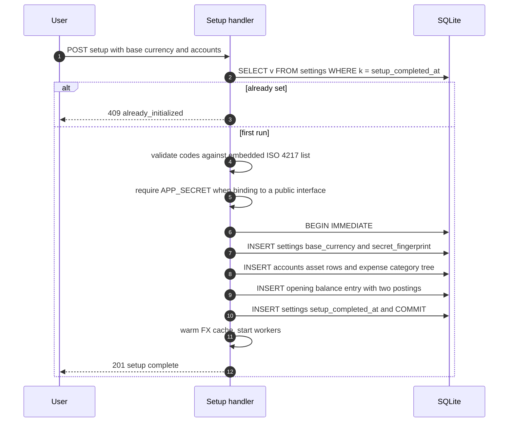
```mermaid
sequenceDiagram
    autonumber
    participant U as User
    participant API as Setup handler
    participant DB as SQLite
    U->>API: POST setup with base currency and accounts
    API->>DB: SELECT v FROM settings WHERE k = setup_completed_at
    alt already set
        API-->>U: 409 already_initialized
    else first run
        API->>API: validate codes against embedded ISO 4217 list
        API->>API: require APP_SECRET when binding to a public interface
        API->>DB: BEGIN IMMEDIATE
        API->>DB: INSERT settings base_currency and secret_fingerprint
        API->>DB: INSERT accounts asset rows and expense category tree
        API->>DB: INSERT opening balance entry with two postings
        API->>DB: INSERT settings setup_completed_at and COMMIT
        API->>API: warm FX cache, start workers
        API-->>U: 201 setup complete
    end
```

## 3.2 `POST /api/session`

`{ "password": "..." }` → `Set-Cookie: spenicle=...; HttpOnly; SameSite=Lax`.
`501` when `PASSWORD` is unset, so the UI skips the login screen.

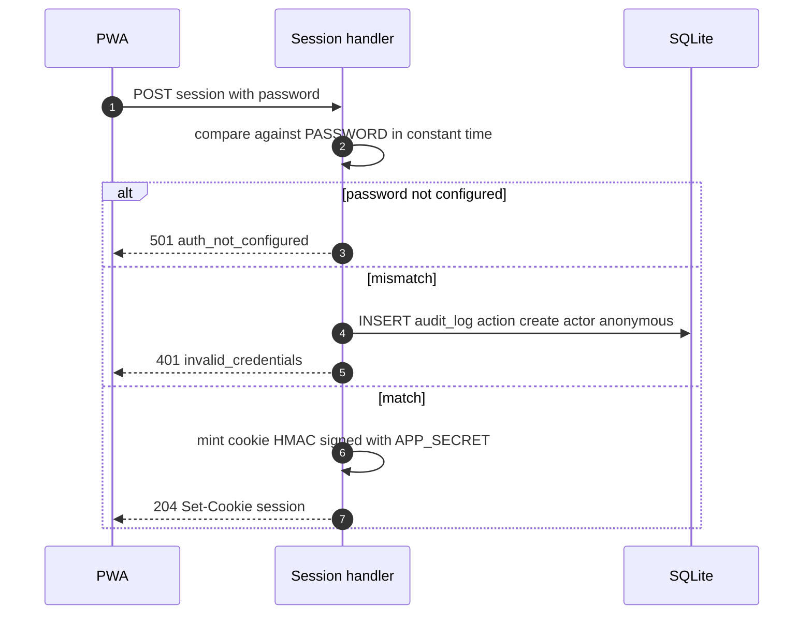
```mermaid
sequenceDiagram
    autonumber
    participant UI as PWA
    participant API as Session handler
    participant DB as SQLite
    UI->>API: POST session with password
    API->>API: compare against PASSWORD in constant time
    alt password not configured
        API-->>UI: 501 auth_not_configured
    else mismatch
        API->>DB: INSERT audit_log action create actor anonymous
        API-->>UI: 401 invalid_credentials
    else match
        API->>API: mint cookie HMAC signed with APP_SECRET
        API-->>UI: 204 Set-Cookie session
    end
```

## 3.3 `GET /api/meta`

```json
{ "settings": { "base_currency":"IDR", "extraction_enabled":false },
  "accounts": [{ "id":3, "name":"BCA Tahapan", "kind":"asset", "balance_minor":"9540000" }],
  "payees": [{ "id":12, "name":"Kopi Kenangan", "last_used_at":"2026-02-14" }],
  "recurring": [{ "id":4, "payee":"Netflix", "cadence":"monthly", "next_due_on":"2026-03-02" }],
  "currencies": [{ "code":"IDR", "minor_units":0, "symbol":"Rp" }] }
```

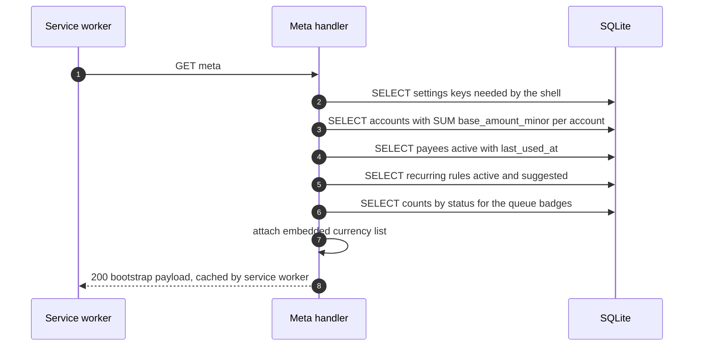
```mermaid
sequenceDiagram
    autonumber
    participant SW as Service worker
    participant API as Meta handler
    participant DB as SQLite
    SW->>API: GET meta
    API->>DB: SELECT settings keys needed by the shell
    API->>DB: SELECT accounts with SUM base_amount_minor per account
    API->>DB: SELECT payees active with last_used_at
    API->>DB: SELECT recurring rules active and suggested
    API->>DB: SELECT counts by status for the queue badges
    API->>API: attach embedded currency list
    API-->>SW: 200 bootstrap payload, cached by service worker
```

## 3.4 `PATCH /api/settings`

`{ "extraction_enabled": true, "extraction_api_url": "...", "last_used_account_id": 3 }`.
`base_currency` → `409 base_currency_locked`.

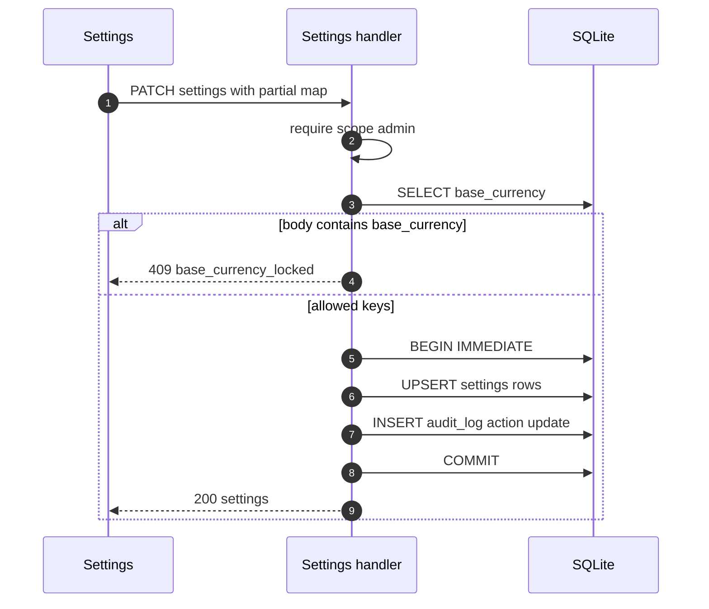
```mermaid
sequenceDiagram
    autonumber
    participant UI as Settings
    participant API as Settings handler
    participant DB as SQLite
    UI->>API: PATCH settings with partial map
    API->>API: require scope admin
    API->>DB: SELECT base_currency
    alt body contains base_currency
        API-->>UI: 409 base_currency_locked
    else allowed keys
        API->>DB: BEGIN IMMEDIATE
        API->>DB: UPSERT settings rows
        API->>DB: INSERT audit_log action update
        API->>DB: COMMIT
        API-->>UI: 200 settings
    end
```

## 3.5 `POST /api/accounts`

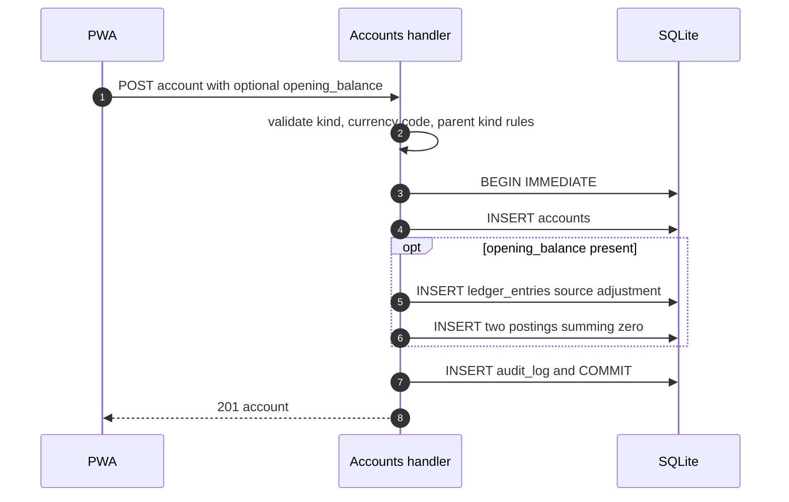
```mermaid
sequenceDiagram
    autonumber
    participant UI as PWA
    participant API as Accounts handler
    participant DB as SQLite
    UI->>API: POST account with optional opening_balance
    API->>API: validate kind, currency code, parent kind rules
    API->>DB: BEGIN IMMEDIATE
    API->>DB: INSERT accounts
    opt opening_balance present
        API->>DB: INSERT ledger_entries source adjustment
        API->>DB: INSERT two postings summing zero
    end
    API->>DB: INSERT audit_log and COMMIT
    API-->>UI: 201 account
```

## 3.6 `PATCH /api/accounts/{id}`


```mermaid
sequenceDiagram
    autonumber
    participant UI as PWA
    participant API as Accounts handler
    participant DB as SQLite
    UI->>API: PATCH account id
    API->>DB: SELECT account
    alt kind change requested
        API-->>UI: 409 kind_immutable
    else allowed
        API->>API: reject parent cycle, archive keeps history
        API->>DB: BEGIN IMMEDIATE
        API->>DB: UPDATE accounts SET changed fields
        API->>DB: INSERT audit_log from_json to_json and COMMIT
        API-->>UI: 200 account
    end
```

## 3.7 `POST /api/payees`


```mermaid
sequenceDiagram
    autonumber
    participant UI as PWA
    participant API as Payees handler
    participant DB as SQLite
    UI->>API: POST payee
    API->>DB: SELECT payees WHERE lower name equals
    alt exists
        API-->>UI: 200 existing payee, idempotent
    else new
        API->>DB: INSERT payees and audit_log
        API-->>UI: 201 payee
    end
```

## 3.8 `PATCH /api/payees/{id}`

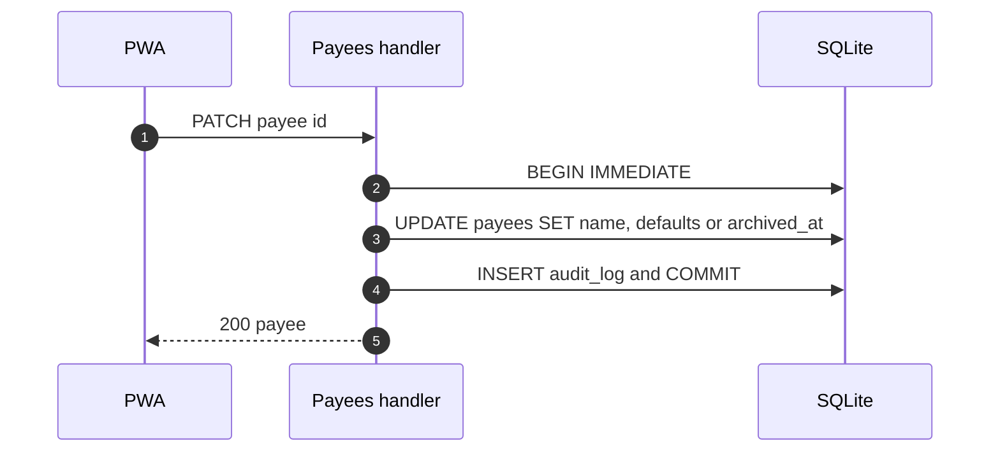
```mermaid
sequenceDiagram
    autonumber
    participant UI as PWA
    participant API as Payees handler
    participant DB as SQLite
    UI->>API: PATCH payee id
    API->>DB: BEGIN IMMEDIATE
    API->>DB: UPDATE payees SET name, defaults or archived_at
    API->>DB: INSERT audit_log and COMMIT
    API-->>UI: 200 payee
```

## 3.9 `GET /api/entries`

`?from&to&account_id&payee_id&id&source&running_balance=true&cursor&limit`

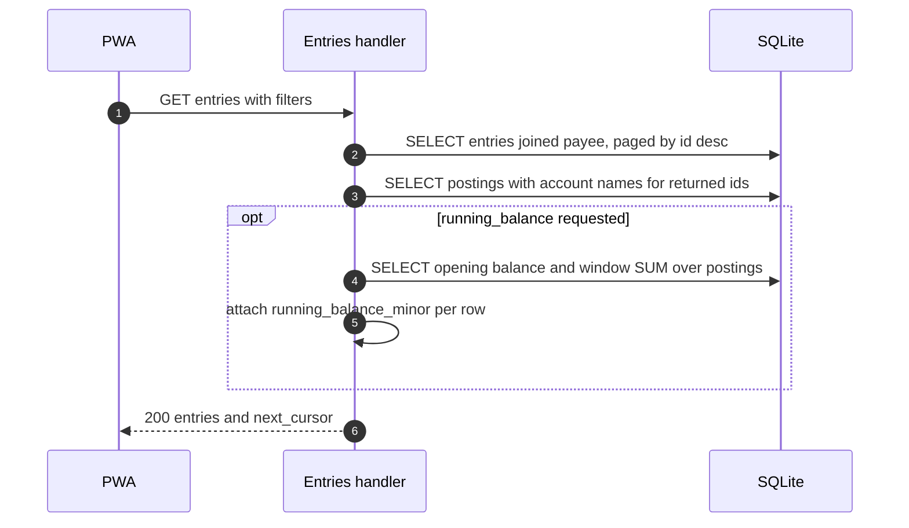
```mermaid
sequenceDiagram
    autonumber
    participant UI as PWA
    participant API as Entries handler
    participant DB as SQLite
    UI->>API: GET entries with filters
    API->>DB: SELECT entries joined payee, paged by id desc
    API->>DB: SELECT postings with account names for returned ids
    opt running_balance requested
        API->>DB: SELECT opening balance and window SUM over postings
        API->>API: attach running_balance_minor per row
    end
    API-->>UI: 200 entries and next_cursor
```

## 3.10 `POST /api/entries`

```json
{ "client_id":"01924f7c-8f3a-7c11-9d0e-2b7f5a1c9e42",
  "occurred_on":"2025-09-14", "payee_id":12, "note":"flat white",
  "currency":"IDR",
  "postings":[{ "account_id":21, "amount_minor":"25000" },
              { "account_id":3,  "amount_minor":"-25000" }] }
```

Note the date: three months back. Any month is writable, because the ledger is the only truth.

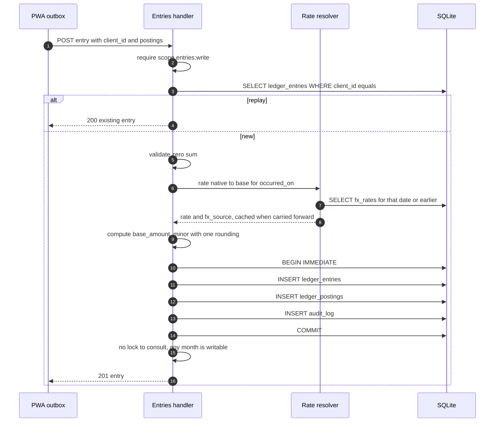
```mermaid
sequenceDiagram
    autonumber
    participant PWA as PWA outbox
    participant API as Entries handler
    participant FX as Rate resolver
    participant DB as SQLite
    PWA->>API: POST entry with client_id and postings
    API->>API: require scope entries:write
    API->>DB: SELECT ledger_entries WHERE client_id equals
    alt replay
        API-->>PWA: 200 existing entry
    else new
        API->>API: validate zero sum
        API->>FX: rate native to base for occurred_on
        FX->>DB: SELECT fx_rates for that date or earlier
        FX-->>API: rate and fx_source, cached when carried forward
        API->>API: compute base_amount_minor with one rounding
        API->>DB: BEGIN IMMEDIATE
        API->>DB: INSERT ledger_entries
        API->>DB: INSERT ledger_postings
        API->>DB: INSERT audit_log
        API->>DB: COMMIT
        API->>API: no lock to consult, any month is writable
        API-->>PWA: 201 entry
    end
```

## 3.11 `PATCH /api/entries/{id}`

```json
{ "note":"flat white, large", "payee_id":13 }
{ "void": true, "reason": "duplicate of 811" }
```

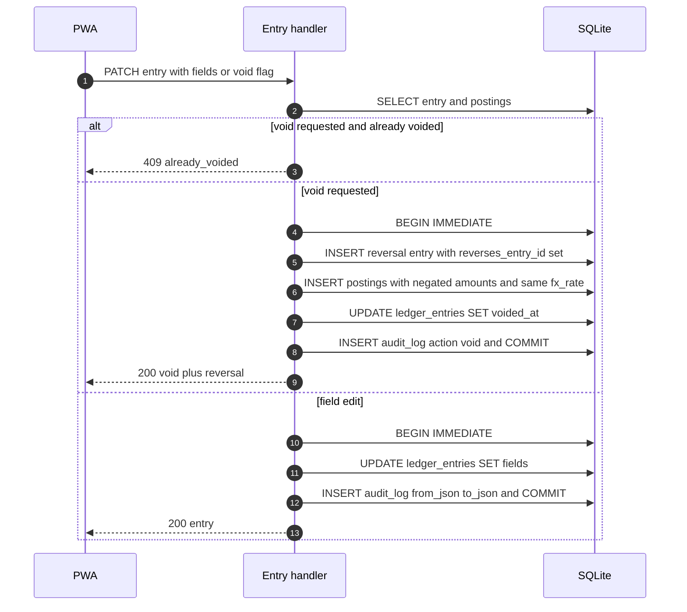
```mermaid
sequenceDiagram
    autonumber
    participant UI as PWA
    participant API as Entry handler
    participant DB as SQLite
    UI->>API: PATCH entry with fields or void flag
    API->>DB: SELECT entry and postings
    alt void requested and already voided
        API-->>UI: 409 already_voided
    else void requested
        API->>DB: BEGIN IMMEDIATE
        API->>DB: INSERT reversal entry with reverses_entry_id set
        API->>DB: INSERT postings with negated amounts and same fx_rate
        API->>DB: UPDATE ledger_entries SET voided_at
        API->>DB: INSERT audit_log action void and COMMIT
        API-->>UI: 200 void plus reversal
    else field edit
        API->>DB: BEGIN IMMEDIATE
        API->>DB: UPDATE ledger_entries SET fields
        API->>DB: INSERT audit_log from_json to_json and COMMIT
        API-->>UI: 200 entry
    end
```

## 3.12 `GET /api/captures`

`?status=pending&batch_id=&cursor=&limit=20`. Extracting first, then oldest pending.

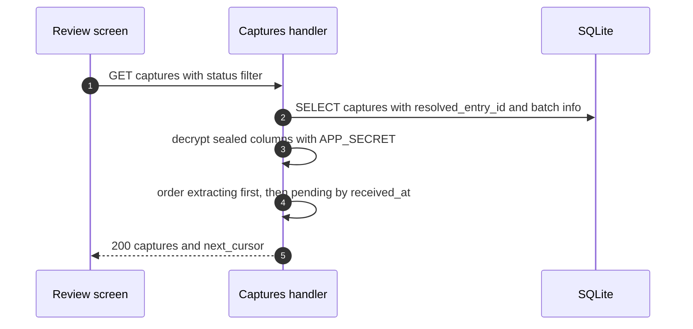
```mermaid
sequenceDiagram
    autonumber
    participant UI as Review screen
    participant API as Captures handler
    participant DB as SQLite
    UI->>API: GET captures with status filter
    API->>DB: SELECT captures with resolved_entry_id and batch info
    API->>API: decrypt sealed columns with APP_SECRET
    API->>API: order extracting first, then pending by received_at
    API-->>UI: 200 captures and next_cursor
```

## 3.13 `POST /api/captures`

```json
{ "client_id":"01924f7c-...", "kind":"share",
  "raw_text":"BCA: Transaksi Rp25.000 di KOPI KENANGAN 14/02 08:12" }
```

`multipart/form-data` with `file` for images and statements. Always `202`. With extraction
disabled the row stays `pending` with an empty draft and you type the fields.

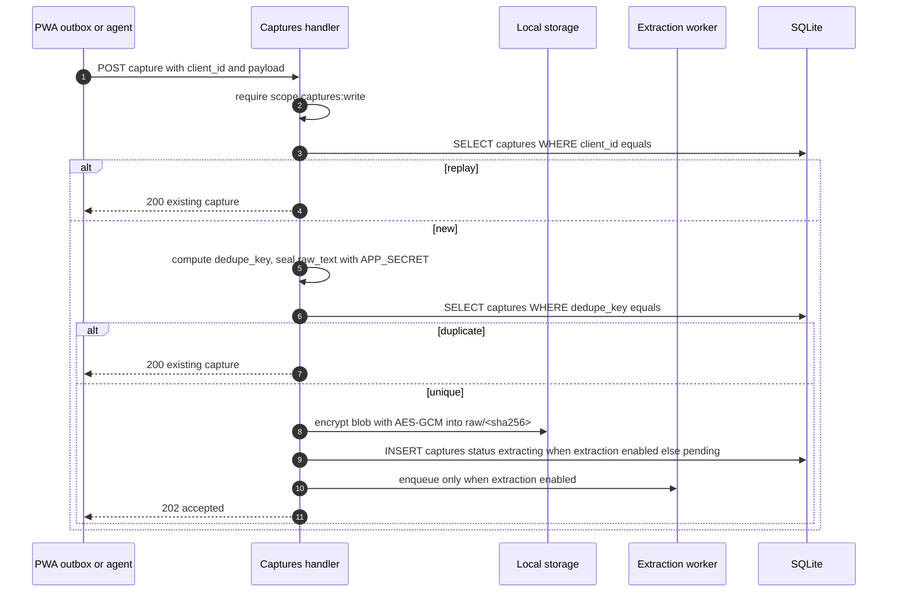
```mermaid
sequenceDiagram
    autonumber
    participant PWA as PWA outbox or agent
    participant API as Captures handler
    participant ST as Local storage
    participant W as Extraction worker
    participant DB as SQLite
    PWA->>API: POST capture with client_id and payload
    API->>API: require scope captures:write
    API->>DB: SELECT captures WHERE client_id equals
    alt replay
        API-->>PWA: 200 existing capture
    else new
        API->>API: compute dedupe_key, seal raw_text with APP_SECRET
        API->>DB: SELECT captures WHERE dedupe_key equals
        alt duplicate
            API-->>PWA: 200 existing capture
        else unique
            API->>ST: encrypt blob with AES-GCM into raw/<sha256>
            API->>DB: INSERT captures status extracting when extraction enabled else pending
            API->>W: enqueue only when extraction enabled
            API-->>PWA: 202 accepted
        end
    end
```

## 3.14 `PATCH /api/captures/{id}`

```json
{ "action": "approve", "payee_id": 12, "occurred_on": "2025-09-14", "currency": "IDR",
  "postings": [{ "account_id": 21, "amount_minor": "25000" },
               { "account_id": 3,  "amount_minor": "-25000" }] }
{ "action": "reject", "reason": "not my card" }
{ "action": "retry" }
{ "action": "match", "entry_id": 811 }
{ "action": "extracted", "draft": { "...": "provider output, schema owned by provider" } }
```

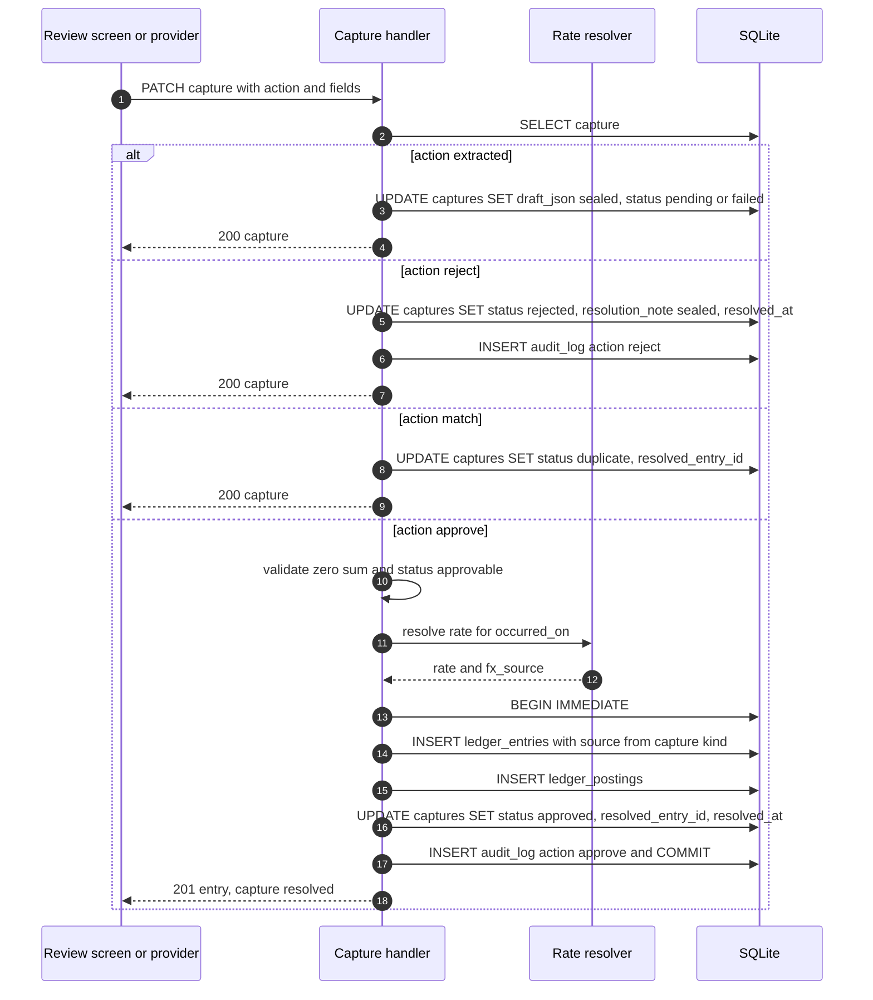
```mermaid
sequenceDiagram
    autonumber
    participant UI as Review screen or provider
    participant API as Capture handler
    participant FX as Rate resolver
    participant DB as SQLite
    UI->>API: PATCH capture with action and fields
    API->>DB: SELECT capture
    alt action extracted
        API->>DB: UPDATE captures SET draft_json sealed, status pending or failed
        API-->>UI: 200 capture
    else action reject
        API->>DB: UPDATE captures SET status rejected, resolution_note sealed, resolved_at
        API->>DB: INSERT audit_log action reject
        API-->>UI: 200 capture
    else action match
        API->>DB: UPDATE captures SET status duplicate, resolved_entry_id
        API-->>UI: 200 capture
    else action approve
        API->>API: validate zero sum and status approvable
        API->>FX: resolve rate for occurred_on
        FX-->>API: rate and fx_source
        API->>DB: BEGIN IMMEDIATE
        API->>DB: INSERT ledger_entries with source from capture kind
        API->>DB: INSERT ledger_postings
        API->>DB: UPDATE captures SET status approved, resolved_entry_id, resolved_at
        API->>DB: INSERT audit_log action approve and COMMIT
        API-->>UI: 201 entry, capture resolved
    end
```

## 3.15 `POST /api/recurring`

Create directly, or promote an entry: `?from_entry_id=812`.

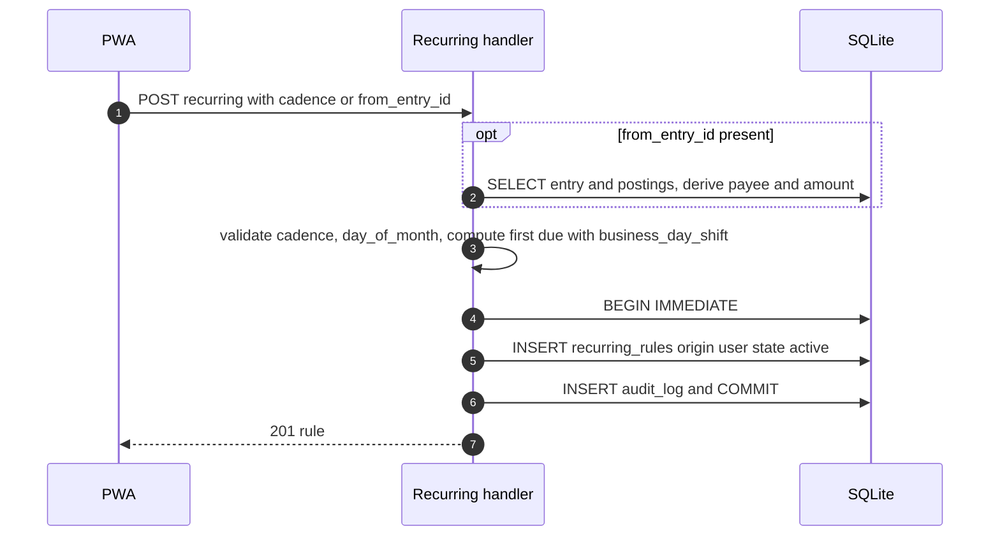
```mermaid
sequenceDiagram
    autonumber
    participant UI as PWA
    participant API as Recurring handler
    participant DB as SQLite
    UI->>API: POST recurring with cadence or from_entry_id
    opt from_entry_id present
        API->>DB: SELECT entry and postings, derive payee and amount
    end
    API->>API: validate cadence, day_of_month, compute first due with business_day_shift
    API->>DB: BEGIN IMMEDIATE
    API->>DB: INSERT recurring_rules origin user state active
    API->>DB: INSERT audit_log and COMMIT
    API-->>UI: 201 rule
```

## 3.16 `PATCH /api/recurring/{id}`

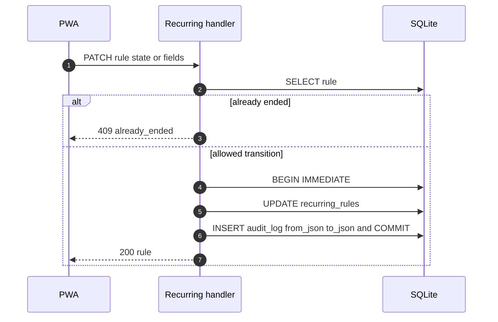
```mermaid
sequenceDiagram
    autonumber
    participant UI as PWA
    participant API as Recurring handler
    participant DB as SQLite
    UI->>API: PATCH rule state or fields
    API->>DB: SELECT rule
    alt already ended
        API-->>UI: 409 already_ended
    else allowed transition
        API->>DB: BEGIN IMMEDIATE
        API->>DB: UPDATE recurring_rules
        API->>DB: INSERT audit_log from_json to_json and COMMIT
        API-->>UI: 200 rule
    end
```

## 3.17 `GET /api/months/{year_month}`

Derived, never stored. Optional `?statement_balance[3]=9540000` per account.

The ledger is the only truth: no close table, no snapshot, no lock. A month is just a range of
`occurred_on`, and this recomputes the diff every time you look.

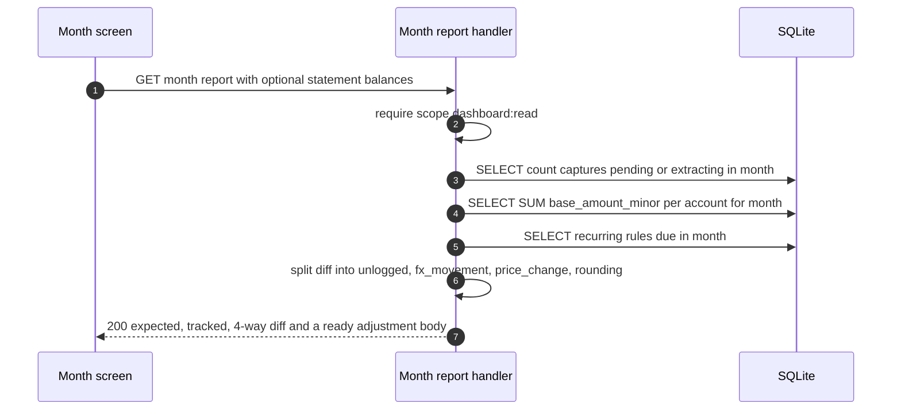
```mermaid
sequenceDiagram
    autonumber
    participant UI as Month screen
    participant API as Month report handler
    participant DB as SQLite
    UI->>API: GET month report with optional statement balances
    API->>API: require scope dashboard:read
    API->>DB: SELECT count captures pending or extracting in month
    API->>DB: SELECT SUM base_amount_minor per account for month
    API->>DB: SELECT recurring rules due in month
    API->>API: split diff into unlogged, fx_movement, price_change, rounding
    API-->>UI: 200 expected, tracked, 4-way diff and a ready adjustment body
```

The response carries `adjustment_body`, a ready-to-POST `POST /api/entries` payload for the
unlogged bucket. Posting it is your decision; the report itself writes nothing.

## 3.18 `GET /api/dashboard`

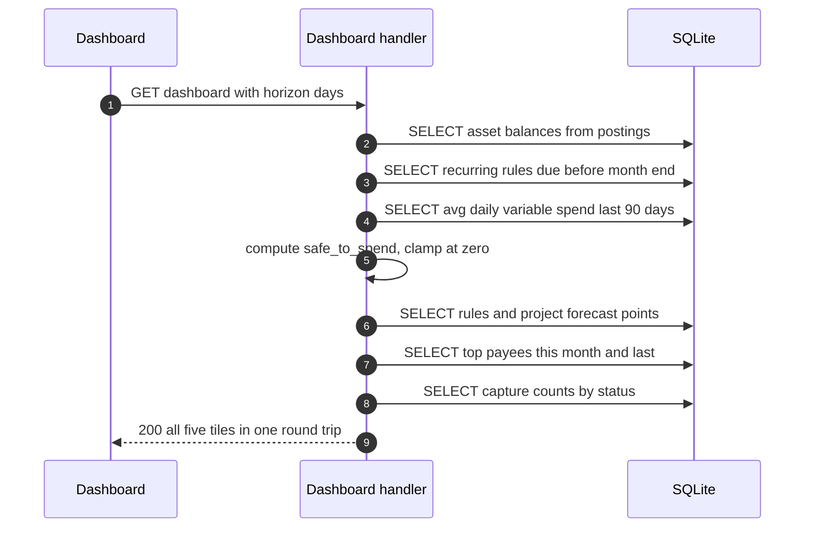
```mermaid
sequenceDiagram
    autonumber
    participant UI as Dashboard
    participant API as Dashboard handler
    participant DB as SQLite
    UI->>API: GET dashboard with horizon days
    API->>DB: SELECT asset balances from postings
    API->>DB: SELECT recurring rules due before month end
    API->>DB: SELECT avg daily variable spend last 90 days
    API->>API: compute safe_to_spend, clamp at zero
    API->>DB: SELECT rules and project forecast points
    API->>DB: SELECT top payees this month and last
    API->>DB: SELECT capture counts by status
    API-->>UI: 200 all five tiles in one round trip
```

## 3.19 `POST /api/tokens`

`{ "name":"laptop-agent", "scopes":["captures:write","dashboard:read"] }`
Returns `{ "id":2, "token":"spn_...", "scopes":[...] }` — plaintext shown once.

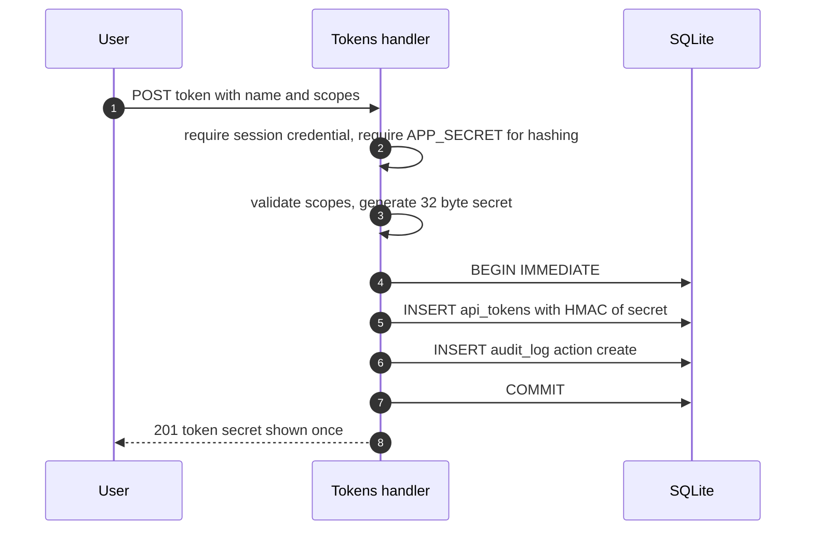
```mermaid
sequenceDiagram
    autonumber
    participant U as User
    participant API as Tokens handler
    participant DB as SQLite
    U->>API: POST token with name and scopes
    API->>API: require session credential, require APP_SECRET for hashing
    API->>API: validate scopes, generate 32 byte secret
    API->>DB: BEGIN IMMEDIATE
    API->>DB: INSERT api_tokens with HMAC of secret
    API->>DB: INSERT audit_log action create
    API->>DB: COMMIT
    API-->>U: 201 token secret shown once
```

## 3.20 `PATCH /api/tokens/{id}`

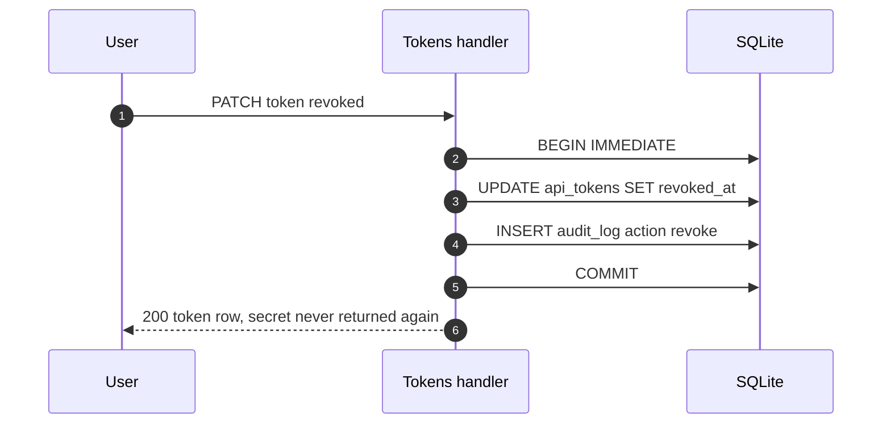
```mermaid
sequenceDiagram
    autonumber
    participant U as User
    participant API as Tokens handler
    participant DB as SQLite
    U->>API: PATCH token revoked
    API->>DB: BEGIN IMMEDIATE
    API->>DB: UPDATE api_tokens SET revoked_at
    API->>DB: INSERT audit_log action revoke
    API->>DB: COMMIT
    API-->>U: 200 token row, secret never returned again
```

## 3.21 `GET /healthz`

`200 {"status":"ok","schema_version":3,"app_secret":"sealed","rate_cache_age_s":3600}`

```mermaid
sequenceDiagram
    autonumber
    participant M as Monitor
    participant API as Health handler
    participant DB as SQLite
    M->>API: GET healthz
    API->>DB: SELECT version FROM schema_migrations
    API->>DB: probe WAL writability with SELECT 1
    API->>DB: compare settings secret_fingerprint with APP_SECRET
    alt db ok and secret matches
        API-->>M: 200 status ok
    else mismatch or db failing
        API-->>M: 503 status degraded with reason
    end
```

---

# 4. Workers

| worker | trigger | writes |
| --- | --- | --- |
| `ExtractionWorker` | queue, only when extraction enabled | `captures.draft_json`, `captures.status` |
| `RecurringWorker` | hourly | `captures` with `kind='recurring'`, advances `next_due_on` |
| `DetectionWorker` | weekly | `recurring_rules` `origin='detected'` |
| `RateWorker` | boot + 16:30 CET | `fx_rates`, memory cache |
| `IntegrityWorker` | boot + after import | zero-sum verification, reports to `audit_log` |
| `ArtifactPruner` | weekly | deletes `raw/<hash>` older than N days, ledger untouched |
